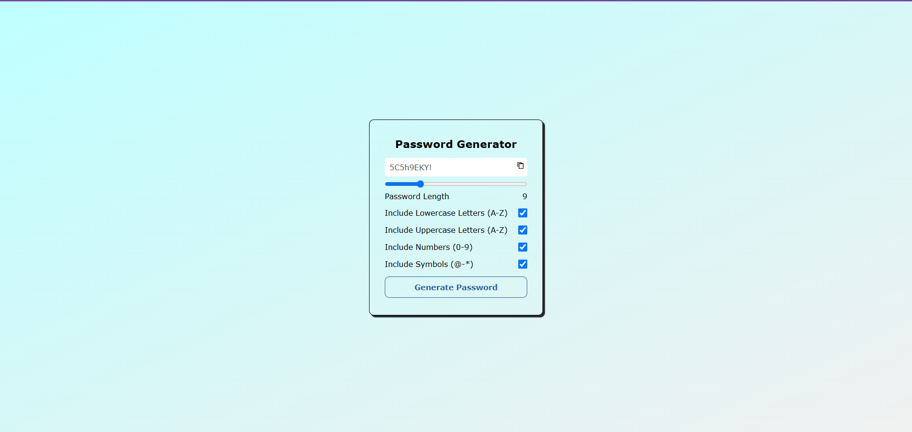

# 🔐 Password Generator

A modern and responsive Password Generator built using HTML, CSS, and JavaScript.

The application allows users to generate strong and customizable passwords by selecting different character sets such as uppercase letters, lowercase letters, numbers, and special symbols.

---

Preview



---

Features

- Generate secure random passwords
- Adjustable password length
- Include uppercase letters (A-Z)
- Include lowercase letters (a-z)
- Include numbers (0-9)
- Include special symbols
- Copy password to clipboard with one click
- Responsive user interface
- Clean and minimal design

---

Technologies Used

- HTML5
- CSS3
- JavaScript (ES6)

---

Project Structure

```
password-generator
│
├── index.html
├── style.css
├── script.js
├── README.md
└── assets
      └── screenshot.png
```

---

Installation

Clone the repository

```bash
git clone https://github.com/yourusername/password-generator.git
```

Go to the project folder

```bash
cd password-generator
```

Open

```
index.html
```

in your browser.

No additional dependencies are required.

---

How It Works

1. Select the desired password length.
2. Choose the character types you want.
3. Click Generate Password.
4. Copy the generated password using the copy icon.

---

Concepts Practiced

- DOM Manipulation
- Event Listeners
- Random Number Generation
- JavaScript Functions
- Conditional Statements
- Clipboard API
- Responsive Web Design

---

Future Improvements

- Password Strength Indicator
- Dark / Light Mode
- Password History
- Show / Hide Password
- Password Entropy Meter
- Toast Notifications
- Animated UI

---

Author

Jaspreet Singh Soni

GitHub: https://github.com/JaspreetSoni

LinkedIn: https://linkedin.com/in/Jaspreet Singh Soni

---

License

This project is licensed under the MIT License.